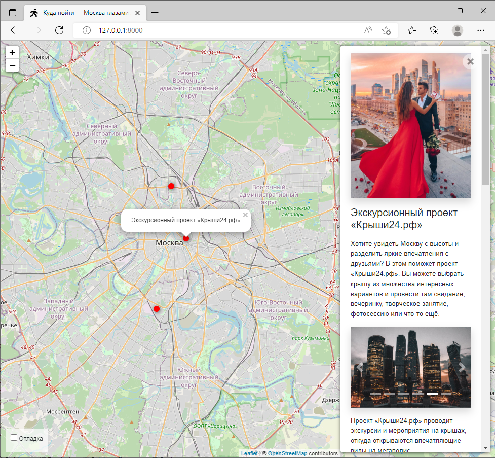

# Куда пойти: о Москве нескучно.

 Проект сайта позволяющий отмечать интересные достопримечательности города 
 на карте, а так же сохранять фотографии этих мест.




[Демка сайта](https://kosmontin.pythonanywhere.com/).

## Как запустить

* Скачайте код
* Распакуйте архив
* Заполните файл `.env`
* Установить [Python](https://python.org/download/) (3.x) 
* Разместите на production-сервере либо запустите локально, используя консоль
* Откройте в браузере


## Настройки
### Переменные окружения

Для корректной работы проекта необходимо настроить переменные окружения.
Для этого нужно либо создать файл `.env`, либо воспользоваться файлом 
из архива `EXAMPLE.env`, переименовав его.
Переменные, необходимые для корректной работы:
* `DEBUG` - режим отладки (True/False)
* `ALLOWED_HOSTS` - адрес домена (Если запускается локально, то: `127.0.0.1,localhost`)
* `SECRET_KEY` - секретный ключ (можно воспользоваться [онлайн](https://djecrety.ir/) генератором)
* `STATIC_ROOT` - полный (абсолютный) путь до папки `static`
* `MEDIA_ROOT` - полный (абсолютный) путь до папки `media`

## Подготовка к запуску

* В папке распакованного проекта создать переменное окружение python
* Активировать переменное акружение 
* Установить зависимости
```bash
pip install -r requirements.txt
```

### Локальный запуск

* Установить `DEBUG=True` в файле `.env` 
* Запустить локальный web-сервер из папки проекта
```bash
python manage.py runserver 8000 
```
* В браузере: [http://127.0.0.1:8000/](http://127.0.0.1:8000/) либо тот порт, который был указан при запуске


### Запуск на рабочем сервере

* На сервере для проекта настроить доступ к папкам `MEDIA_ROOT` и `STATIC_ROOT`
* Скопировать 'static'-файлы командой
```bash
python manage.py collectstatic
```


## Цели проекта

Код написан в учебных целях — проект реализует задачи модуля Django [Devman](https://dvmn.org).

Тестовые данные взяты с сайта [KudaGo](https://kudago.com).

